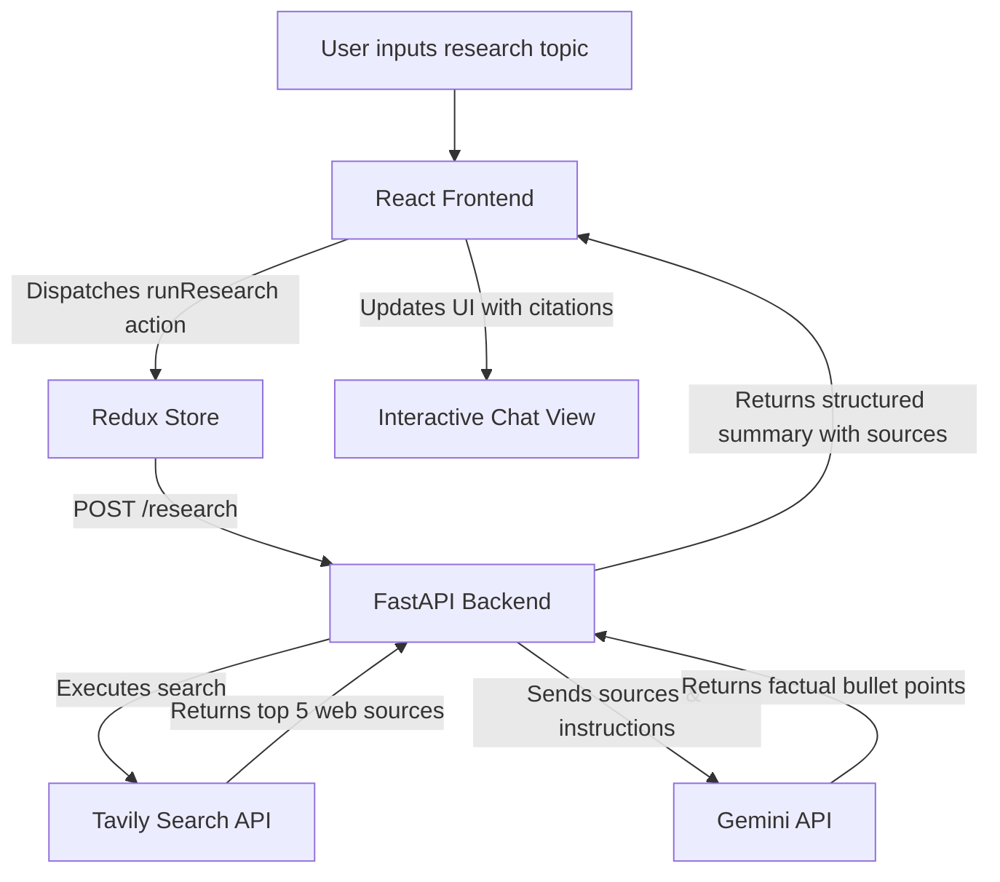

# AI Research Agent 

An intelligent web research and synthesis agent that searches the web for any given topic, crawls content, and uses Gemini AI to compile structured, factual summaries with interactive source citations.

---

## Key Features

- **Autonomous Web Search**: Leverages the **Tavily API** to perform targeted web searches and extract clean, relevant content from the top 5 sources.
- **AI Synthesis**: Uses **Gemini (via `google-genai`)** to analyze, filter, and summarize the gathered information into clear, factual bullet points.
- **Interactive UI**: Responsive chat/research interface built with **React**, **Material-UI (MUI)**, and **Redux Toolkit** for state management.
- **Verified Citations**: Every generated bullet point is mapped back to its primary web source, allowing users to hover/click and trace the original source URL.

---

## Architecture & Data Flow



---

## Tech Stack

### Backend
- **Framework**: FastAPI
- **LLM API**: Google GenAI SDK (`google-genai` / `gemini-flash-lite`)
- **Search API**: Tavily Python SDK (`tavily-python`)
- **Validation**: Pydantic
- **Environment**: python-dotenv

### Frontend
- **Framework**: React 19
- **State Management**: Redux Toolkit & Redux Persist
- **Styling**: Material-UI (MUI v7), Emotion, React Icons

---

## Setup & Installation

### Prerequisite APIs
You will need API keys for:
- [Gemini Developer Console](https://aistudio.google.com/)
- [Tavily AI Search](https://tavily.com/)

---

### 1. Backend Setup

1. Navigate to the backend directory:
   ```bash
   cd backend
   ```
2. Create and activate a virtual environment:
   ```bash
   # On Windows (PowerShell)
   python -m venv .venv
   .\.venv\Scripts\activate

   # On macOS/Linux
   python3 -m venv .venv
   source .venv/bin/activate
   ```
3. Install dependencies:
   ```bash
   pip install -r requirements.txt
   ```
4. Create a `.env` file in the `backend/` directory:
   ```env
   GEMINI_API_KEY=your_gemini_api_key_here
   TAVILY_API_KEY=your_tavily_api_key_here
   ```
5. Start the backend development server:
   ```bash
   uvicorn app:app --reload
   ```
   *The backend will run on `http://127.0.0.1:8000`.*

---

### 2. Frontend Setup

1. Navigate to the frontend directory:
   ```bash
   cd ../frontend
   ```
2. Install the frontend dependencies:
   ```bash
   npm install
   ```
3. Start the React app:
   ```bash
   npm start
   ```
   *The frontend will open at `http://localhost:3000`.*

---

## Usage Example

1. Open the UI at `http://localhost:3000`.
2. Enter a research topic (e.g., *"Quantum Computing applications in finance"*).
3. The AI agent searches the web, parses the best results, and processes them.
4. View the bulleted synthesis where each item features a link pointing to its origin source page.